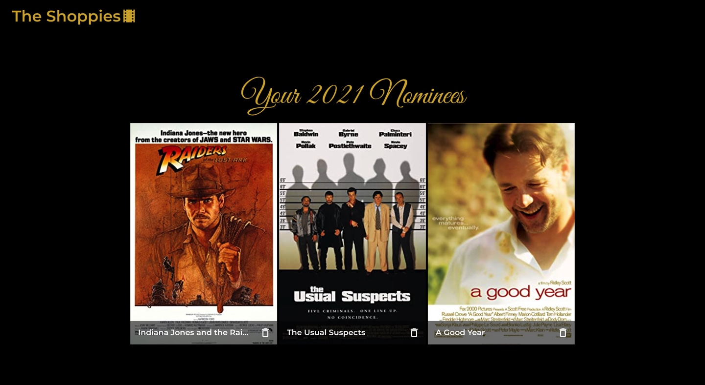

# **The Shoppies**

## **About**
Shopify UX & Web Developer Intern Challenge Summer 2021

By Olivia Tufte

Built with React 17.0.1, Styled with MaterialUI

Deployed with Netlify: [The Shoppies](https://vigilant-pike-56b9cc.netlify.app/)

## **Screenshots**

### Simple User Interface

### Searches the OMDB API and displays the title and year of release for the movies that match the search term

### Add a movie from the search results to your nomination list by clicking the 'Nominate' button 
### Disable the 'Nominate' button

### View the list of films that are already nominated 
### Remove a nominee from the nomination list (by clicking garbage icon on the movie poster)

### Display a banner when a user tries to add a sixth movie to their nomination list

